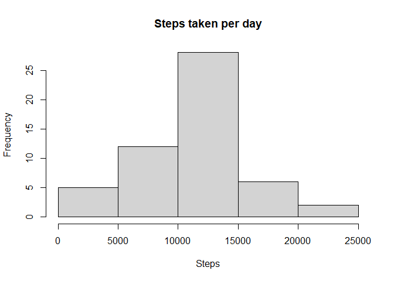
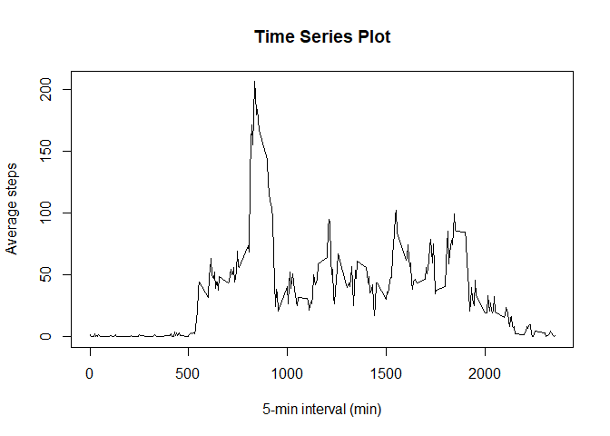
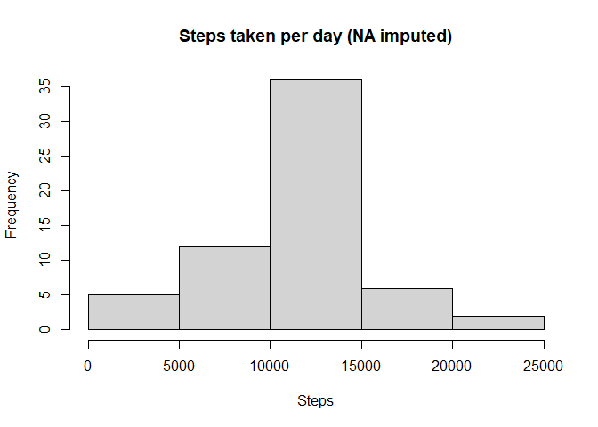
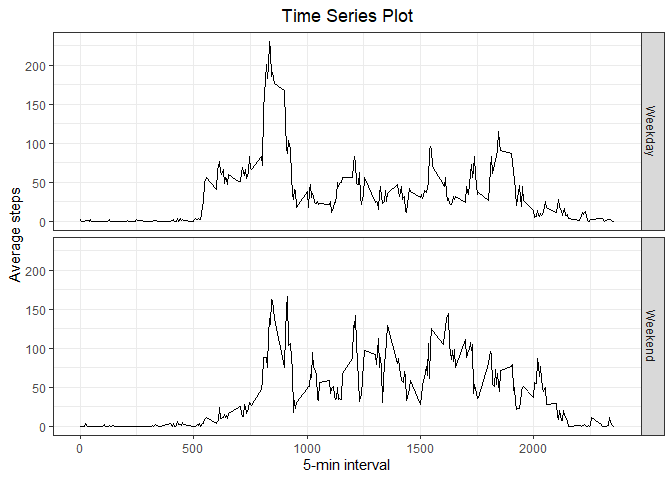

### Load and processing the data


```r
library(dplyr)
data <- read.csv("../activity.csv")
data$date <- as.Date(data$date, "%Y-%m-%d")
```

Date is transformed into class "Date".

### What is mean total number of steps taken per day?

NA values are omitted. 


```r
stepsperday <- na.omit(data) %>% select(steps) %>% split(na.omit(data)$date) %>% sapply(sum)
hist(stepsperday, xlab = "Steps", main = "Steps taken per day")
```

<!-- -->

```r
mean <- mean(stepsperday)
median <- median(stepsperday)
```

The mean and median of the total number of steps taken per day are 1.0766189\times 10^{4} and 10765.

### What is the average daily activity pattern?


```r
pattern <- data %>% group_by(interval) %>% summarise(mean = mean(steps, na.rm = TRUE))
plot(pattern$interval, pattern$mean, type = "l", xlab = "5-min interval (min)", ylab = "Average steps", main = "Time Series Plot")
```

<!-- -->

```r
max <- pattern$interval[which.max(pattern$mean)]
```

The 835 minute interval contains the maximum number of steps.

### Imputing missing values


```r
narows <- sum(is.na(data$steps))
```

There are 2304 missing values (i.e. 2304 rows) in the data set. 


```r
n <- length(data$steps)
for(i in 1:n){
       if(is.na(data$steps[i])){
               data$steps[i] <- pattern$mean[which(pattern$interval == data$interval[i])]
       } 
}
```

Mean of the corresponding 5-min interval value is filled in if there's a missing value.


```r
newstepsperday <- data %>% select(steps) %>% split(data$date) %>% sapply(sum)
hist(newstepsperday, xlab = "Steps", main = "Steps taken per day (NA imputed)")
```

<!-- -->

```r
newmean <- mean(newstepsperday)
newmedian <- median(newstepsperday)
```

The mean and median of the total number of steps taken per day are 1.0766189\times 10^{4} and 1.0766189\times 10^{4}.  
Since NA values are imputed by the mean steps of 5-min interval, the adjusted data shows similar patterns as the NA omitted one (in the first question), which reflects on the mean and median values.

### Are there differences in activity patterns between weekdays and weekends?

An indicator of weekend/weekday is created.


```r
for(i in 1:n){
        if(weekdays(data$date[i]) %in% c("Saturday", "Sunday")){
                data$week[i] <- "Weekend"
        }
        else{
                data$week[i] <- "Weekday"
        }
}
data$week <- as.factor(data$week)
```

Panel plot illustrating average steps taken in each 5-min interval across weekend and weekdays is created by ggplot.   


```r
library(ggplot2)
newpattern <- data %>% group_by(week, interval) %>% summarise(mean = mean(steps))
g <- ggplot(newpattern, aes(interval, mean))
g + geom_line() + facet_grid(week~.) + labs(x = "5-min interval", y = "Average steps", title = "Time Series Plot") + theme_bw() + theme(plot.title = element_text(hjust = 0.5))
```

<!-- -->

The plot shows that the maximum step taken in 5-min interval is decreased on weekends. However, there are more intervals which over 100 steps are taken on weekends. 
